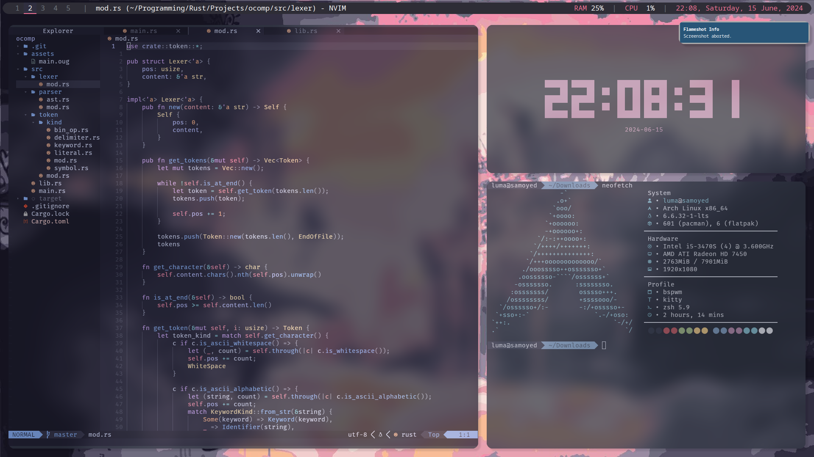

# Oughie's dotfiles

A catppuccin-frappé-themed configuration for Arch Linux that includes:
bspwm, dunst, fastfetch, htop, kitty, lvim, neofetch (deprecated), picom, polybar, rofi, sxhkd, zsh

Wallpapers used can be found [here.](https://github.com/orxngc/walls-catppuccin-mocha)
