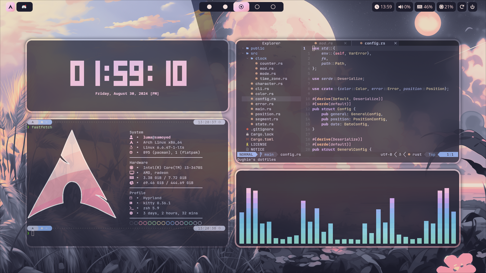

# Oughie's dotfiles

Personal dotfiles for [Hyprland](https://hyprland.org/) on Arch-Linux.

    <a href=".config/bat">Bat</a> •
    <a href=".config/cava">Cava</a> •
    <a href=".config/clock-rs">clock-rs</a> •
    <a href=".config/dunst">Dunst</a> •
    <a href=".config/fastfetch">FastFetch</a> •
    <a href=".config/hypr">Hyprland</a> •
    <a href=".config/kitty">Kitty</a> •
    <a href=".config/nvim">NeoVim</a> •
    <a href=".config/rofi">Rofi</a> •
    <a href=".config/waybar">Waybar</a> •
    <a href=".config/zsh">Oh my Zsh</a>

> [!IMPORTANT]
> This setup uses a German keyboard. See `NeoVim`'s [mappings.lua][mappings-lua] file and [input.conf][input-conf] for `Hyprland`.

## Setup

This repository is mainly configured for personal use. For example, see the [zsh configuration][zshrc].
Apart from these, specific languages' tools used inside `NeoVim`, and basic CLI-commands, there are several additional dependencies:

### Tools

- [catppuccin/cursors](https://github.com/catppuccin/cursors) for a prettier cursor  
- [cliphist](https://github.com/sentriz/cliphist) as a clipboard manager  
- [hyprpicker](https://github.com/hyprwm/hyprpicker) for picking the color of a chosen pixel  
- [hyprshot](https://github.com/Gustash/Hyprshot) to take screenshots  
- [swww](https://github.com/LGFae/swww) for setting the wallpaper  
- [swayidle](https://github.com/swaywm/swayidle) to automatically sleep after periods of inactivity  

### Fonts
- [Awesome 6](https://fontawesome.com/) and [Hack](https://www.nerdfonts.com/) which are used by `waybar`  
- [JetBrains](https://www.nerdfonts.com/) which is used by the `kitty` terminal  

### Directories

There are a few key directories used throughout this entire repository:

- `~/.dotfiles` for the whole configuration  
- `~/Pictures/Screenshots` to store taken screenshots  
- `~/.cache/nvim/undo` as the `undo`-directory used by `NeoVim`  

---

:heart: The wallpapers were taken from another repository that can be found [here](https://github.com/orxngc/walls-catppuccin-mocha).

[zshrc]: https://github.com/Oughie/dotfiles/blob/main/.config/zsh/.zshrc
[mappings-lua]: https://github.com/Oughie/dotfiles/blob/main/.config/nvim/lua/user/mappings.lua?plain=1#L16-L19
[input-conf]: https://github.com/Oughie/dotfiles/blob/7fe0b77fd02e33a068c71bb5c35dc62c51c96847/.config/hypr/modules/input.conf?plain=1#L2
